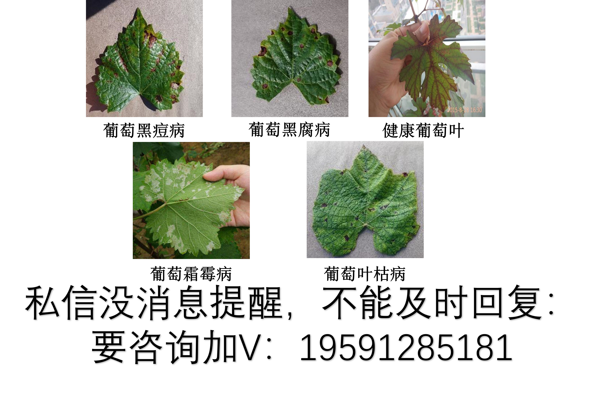
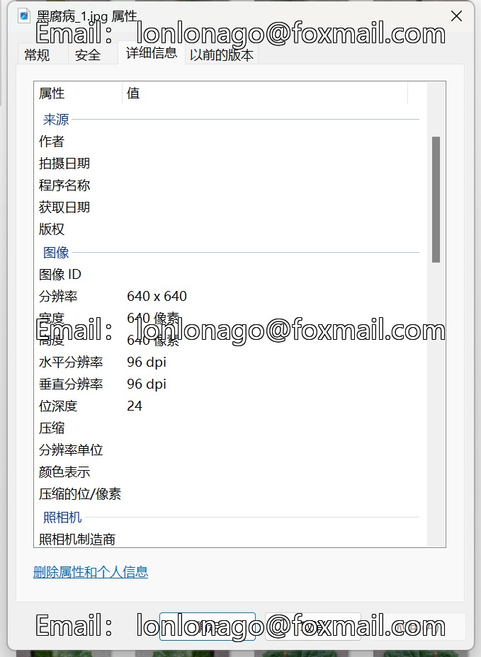

# Dataset for Grape Leaf Diseases

Original dataset information:
- Number of images in folder "Healthy Grape Leaf": 2164
- Number of images in folder "Leaf Blight": 2152
- Number of images in folder "Berberine Mold": 1938
- Number of images in folder "Black Rot": 2360
- Number of images in folder "Black Bean Disease": 2400
Total number of images across all subfolders: 11014
+

Image

Here is a pay link on Stripe ( https://buy.stripe.com/3cs8yP7sY87d0vu9AB ). Please contact me lonlonago@foxmail.com after funding $89, and I will send you a complete data files , thank you!

